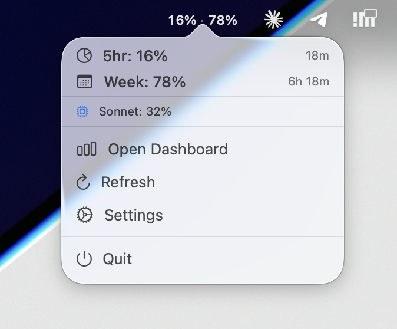

# Claude Usage Systray

A lightweight macOS menu bar app that shows your [Claude.ai](https://claude.ai) plan usage in real time — current session and weekly limits — without opening a browser.



## What it shows

Mirrors the data on `claude.ai/settings/usage`:

| Metric | Description |
|--------|-------------|
| **5h** | Current session usage (resets every ~5 hours) |
| **7d** | Weekly all-models usage |
| **Sonnet** | Weekly Sonnet-only usage (shown in popover) |

Colors update based on your configured warning/critical thresholds.

## Requirements

- macOS 13+
- [Claude Code](https://claude.ai/code) installed and logged in (the app reads its OAuth token from your Keychain — no separate credentials needed)

## Install

**Homebrew (recommended):**

```bash
brew tap adntgv/tap
brew install --cask claude-usage-systray
```

**Manual:**

Download the latest `ClaudeUsageSystray.zip` from the [Releases page](https://github.com/adntgv/claude-usage-systray/releases), unzip, and move `ClaudeUsageSystray.app` to `/Applications`. The app is notarized — macOS will open it normally on first launch.

## Build from source

```bash
git clone https://github.com/adntgv/claude-usage-systray
cd claude-usage-systray
xcodebuild -scheme ClaudeUsageSystray -configuration Release build
open ~/Library/Developer/Xcode/DerivedData/ClaudeUsageSystray-*/Build/Products/Release/ClaudeUsageSystray.app
```

Or open `ClaudeUsageSystray.xcodeproj` in Xcode and run with ⌘R.

### Without Xcode

With only the Command Line Tools installed, build via Swift Package Manager:

```bash
cd claude-usage-systray
./build-app.sh          # -> ClaudeUsageSystray.app
open ClaudeUsageSystray.app
```

`build-app.sh` runs `swift build` and wraps the binary in a minimal `.app`
bundle (needed so notifications work and the Dock icon stays hidden). Note that
`swift test` still requires full Xcode, which ships the `XCTest` framework.
Signed, notarized releases come from the Xcode project.

## Display modes

Toggle **Compact display** in Settings to switch between:

- **Compact (default):** speedometer icon + `5H 86% · W 41%` — 5h session and weekly usage inline
- **Normal:** icon + `71%` — weekly usage only, colored by threshold

## How it works

The app reads your Claude Code OAuth token from the macOS Keychain (`Claude Code-credentials`) and calls the same internal endpoint that powers `claude.ai/settings/usage`:

```
GET https://api.anthropic.com/api/oauth/usage
Authorization: Bearer <oauth_token>
anthropic-beta: oauth-2025-04-20
```

The token is read once at startup and cached in memory. It refreshes automatically when you restart the app (Claude Code keeps it current in the Keychain).

> **Note:** This endpoint is undocumented and may change. It requires Claude Code to be installed and logged in.

## Settings

| Setting | Default | Description |
|---------|---------|-------------|
| Compact display | On | Show both 5h and 7d in menu bar |
| Warning threshold | 80% | Orange color above this |
| Critical threshold | 90% | Red color above this |
| Usage alerts | On | macOS notification when thresholds are crossed |

## Running tests

```bash
xcodebuild test -project ClaudeUsageSystray.xcodeproj \
  -scheme ClaudeUsageSystrayTests \
  -destination 'platform=macOS'
```

## License

MIT
